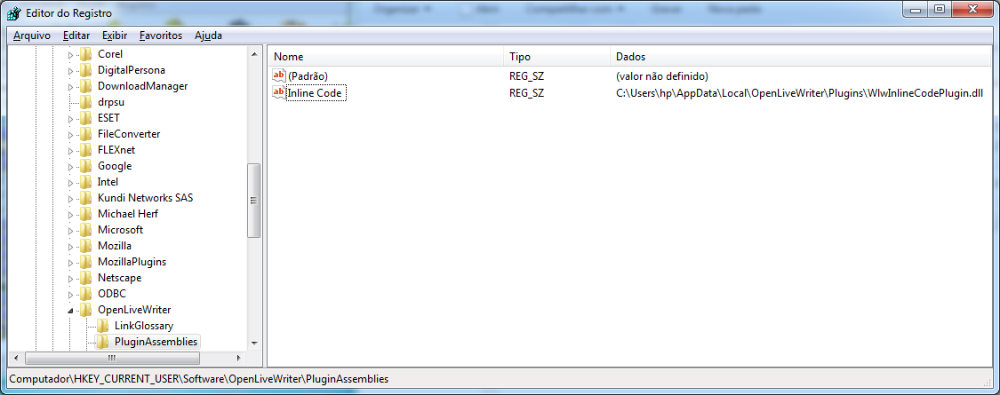
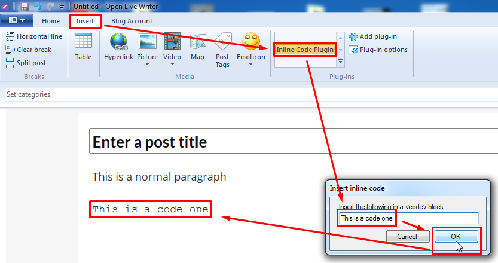

# OLWInlineCode

OLWInlineCode is a port from "[Inline Code Plugin](https://www.ticklishtechs.net/2008/02/21/windows-live-writer-plugin-for-code-in-wordpress/)" (Windows Live Writer) to Open Live Writer.

> But I was missing one function I’m using very often when I write posts on programming. There is no way in the WYSIWYG editor of WLW to format Text like `this`. In WordPress you can use the `<code></code>` tags for code-like formatting. But in WLW I had to switch to the HTML Code view to add these tags.
(Benjamin Schröter, plugin author)

See also: [OLW Paste As](https://github.com/coldscientist/OLWPasteAs).

## Installation
To install the plug-in download it from the link [here](https://github.com/coldscientist/olwinlinecode/releases/latest).

By default OLW will look in the Plugins folder inside the application path (e.g: `C:\Users\UserName\AppData\Local\OpenLiveWriter\app-0.5.1.3\Plugins`) but this path will change as OLW auto-updates itself (i.e. the app number will change). Make sure you are not running Open Live Writer. To install copy the plugin to that path using the latest `…\app-x.x.x.x` folder present on your system. Each time OLW updates to a new version you will need to re-copy or move the plugin into the new `…\app-x.x.x.x` folder. Restart Open Live Writer.

Alternatively use this approach: OLW (like WLW before it) checks the registry for plugins too and so you can add a registry key telling OLW where to find the plugin. Whilst this feature is supported by OLW this should enable the plugin to survive OLW auto updates without you having to do anything. Just download and extract the plugin to a folder on your harddrive and then add a new registry key to `HKEY_CURRENT_USER\SOFTWARE\OpenLiveWriter\PluginAssemblies` with the name (can be anything) and the location of the plugin. For example:



Switch to Open Live Writer, go to the Insert tab, and look in the Plug-ins ribbon group. Select "Insert Inline Code" and the code will be inserted into the document

> When you click it a small dialog asks for the text and if you exit the dialog with the OK button this text is added to your document inside of `<Code>` tags.
(Benjamin Schröter, plugin author)



## Compilling
You may compile the plugin by yourself instead of downloading it if you want to.

You'll need [Microsoft Windows SDK for Windows 7 (7.1)](https://www.microsoft.com/en-us/download/details.aspx?id=8279) to build this project. It's a bit tricky to install, because it's incompatible with a newer version of the Visual C++ 2010 Redistributable and .NET Framework 4 installed. 

* The Windows 7 SDK installs version 10.0.30319 of the Visual C++ 2010 Redistributable. [You must uninstall all versions of the Visual C++ 2010 Redistributable before installing the Windows 7 SDK](https://support.microsoft.com/en-us/help/2717426/windows-sdk-fails-to-install-with-return-code-5100), otherwise you'll receive the errorcode 5010 during installation. After uninstalling the Microsoft Visual C++ 2010 Redistributable products, you may install the Windows 7 SDK.  After installing the Windows 7 SDK, you may then reinstall the newer version of the Visual C++ 2010 Redistributable products, in order to restore the Visual C++ 2010 Redistributable products to their original state.
* The setup is [blocked](https://stackoverflow.com/questions/31455926/windows-sdk-7-1-setup-failure) by:

```
HKEY_LOCAL_MACHINE\SOFTWARE\Wow6432Node\Microsoft\NET Framework Setup\NDP\v4\Full\Version
HKEY_LOCAL_MACHINE\SOFTWARE\Wow6432Node\Microsoft\NET Framework Setup\NDP\v4\Client\Version
```

Change both values temporarily to `4.0.30319` and the setup will let you continue. Make sure you edit the registry with elevated privileges, otherwise you will not be allowed to change the values.

During Windows SDK installation, you need to select only **Tools** from **NET Framework Development** section.

2. You'll need to edit `WlmInlineCodePlugin.csproj` file and change `OpenLiveWriter.Api` Reference directory with your Open Live Writer installation directory.

3. You can compile the code typing the following command at **Command prompt**:

```
"C:\Windows\Microsoft.NET\Framework\v3.5\MSBuild.exe" "C:\Users\hp\Documents\GitHub\OLWInlineCode\WlwCodePlugin\WlwCodePlugin.sln"
```
